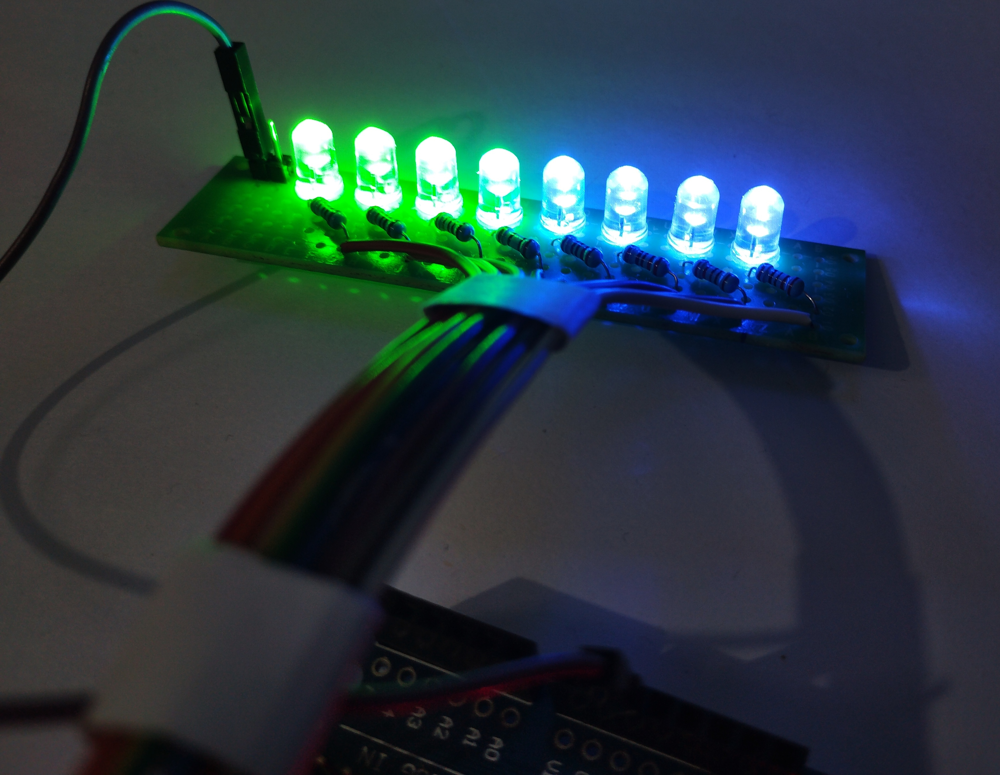
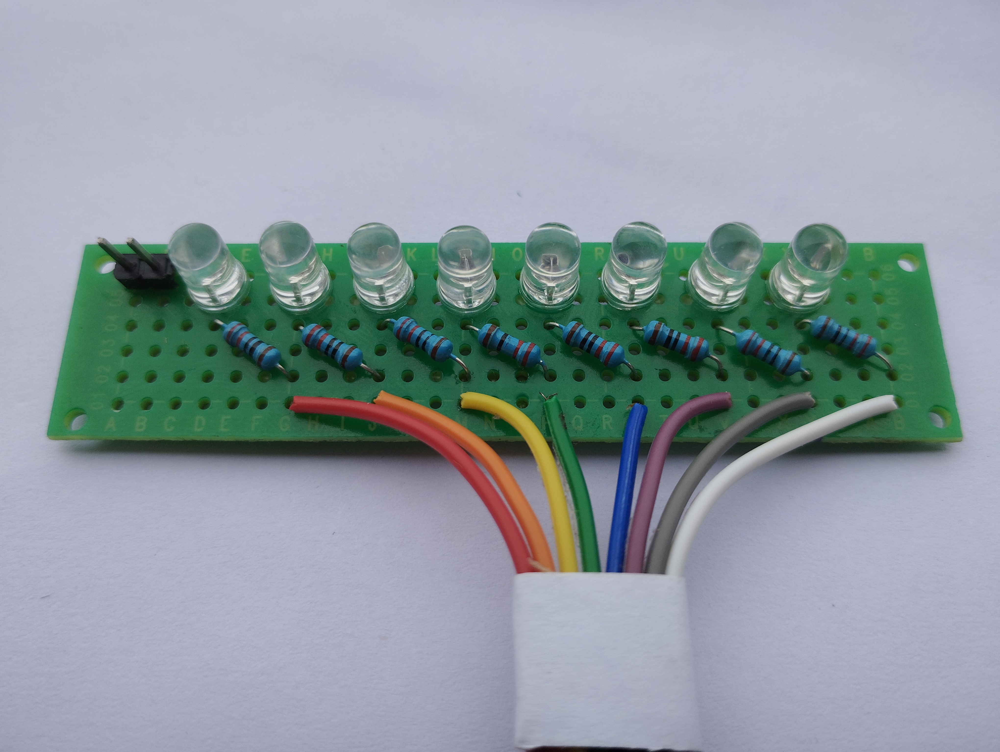
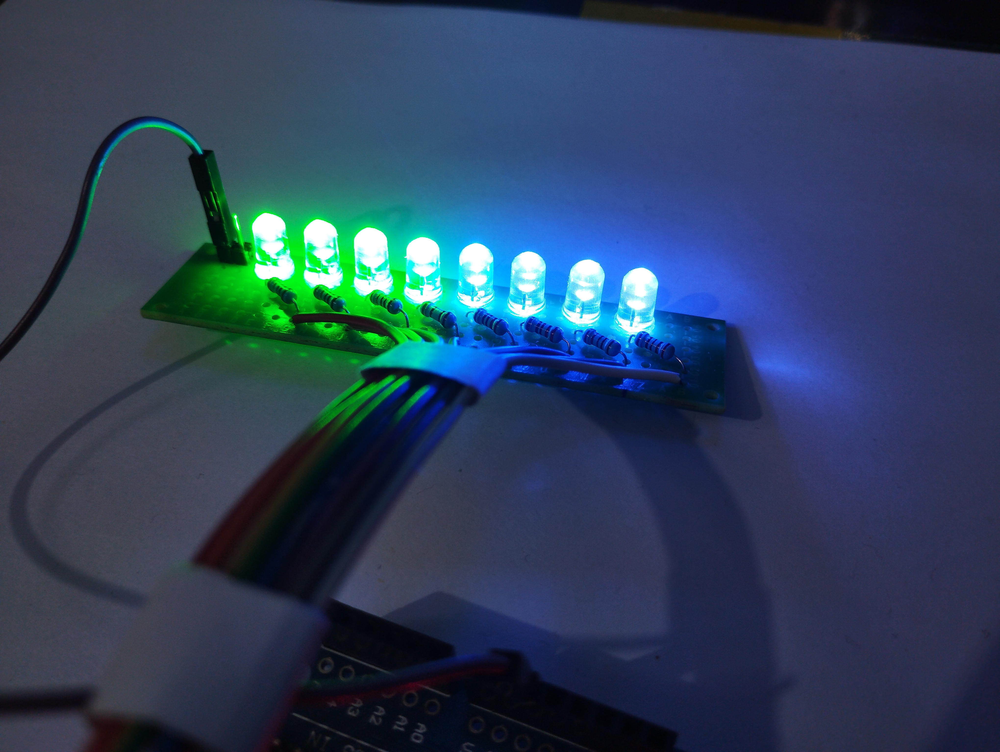
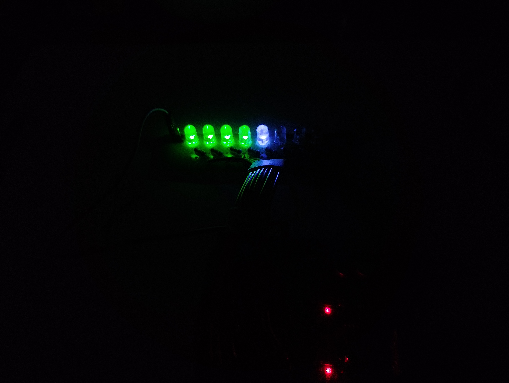
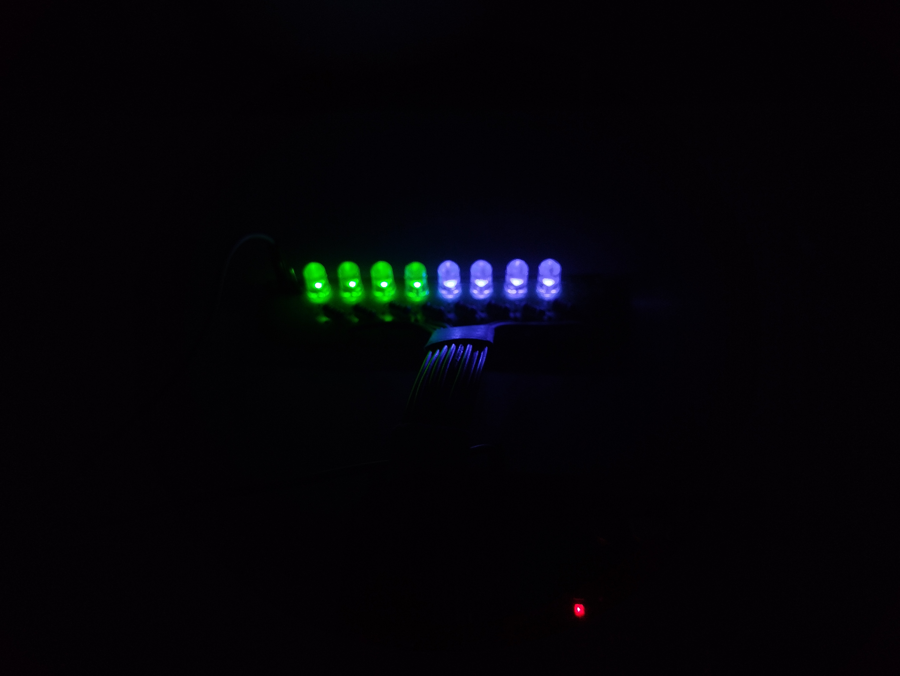
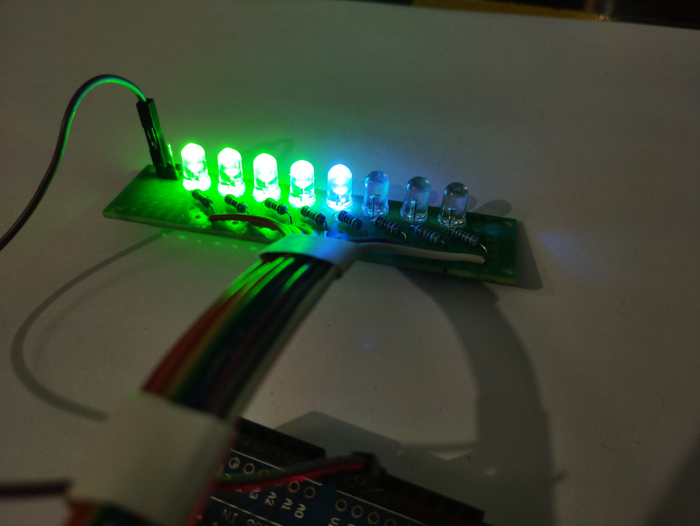
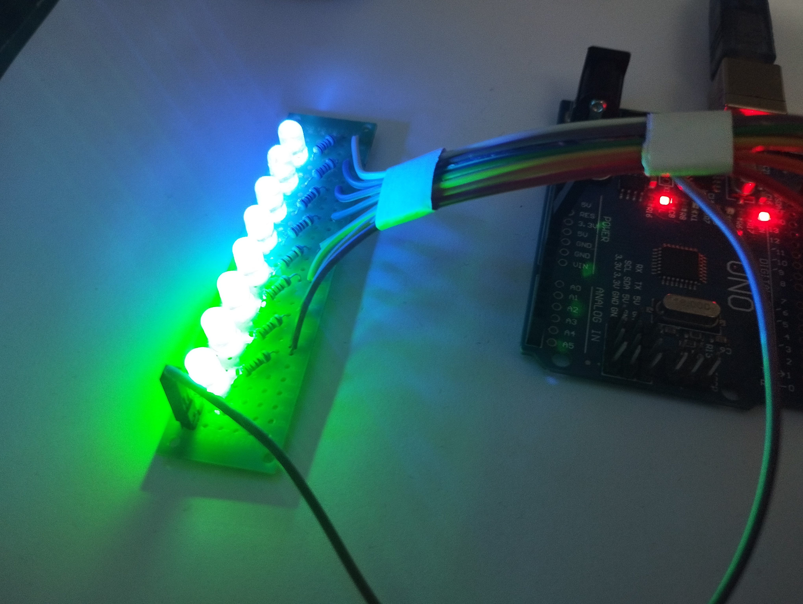

# Arduino LED Chaser 

This Arduino project creates a captivating LED chaser sequence using a simple hardware circuit and Arduino code. The circuit consists of eight LED's connected to digital pins on an Arduino board. The LEDs are programmed to light up in sequence and then reverse, producing an eye-catching animation.

 

 

**Hardware Components:**

- Arduino board (e.g., Arduino Uno)
- Eight LEDs
- Eight 220-330 ohm resistors
- Jumper wires
- Perf board (optional)

**Circuit Connection:**

1. Connect a current-limiting resistor (220-330 ohms) to the longer leg (anode) of each LED.
2. Connect the other end of each resistor to individual digital pins on the Arduino board.
3. Connect the shorter leg (cathode) of each LED to the Arduino's ground (GND) pin.

**How It Works:**

The Arduino sketch sequentially turns on each LED with a short delay, creating a "chasing" effect. After all LEDs are lit, there's a longer pause, and then the sequence reverses. This loop continues indefinitely, resulting in a mesmerizing LED animation.

Feel free to explore, modify, or enhance this project to create your own LED light show!

