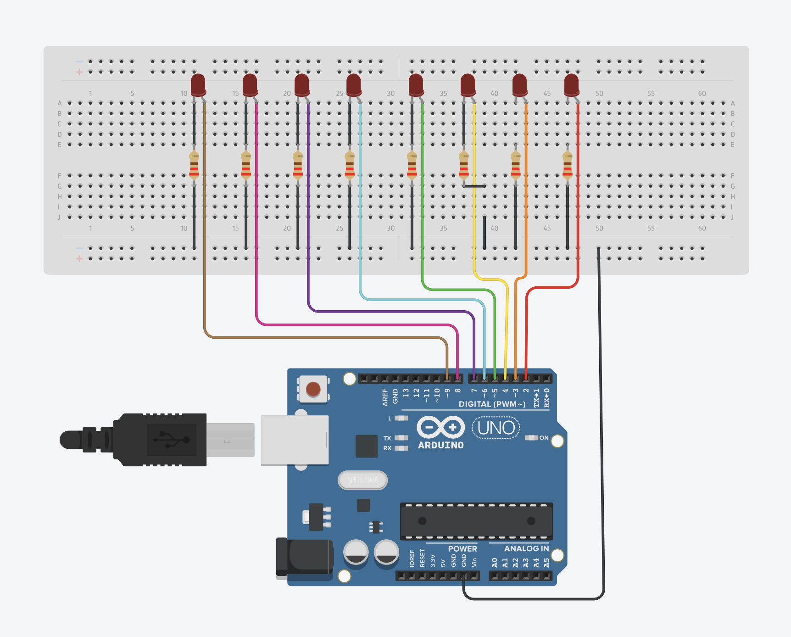

# Arduino LED Chaser v1

This Arduino project creates a captivating LED chaser sequence. This is version-1 of the project and is fairly simple that only loops a basic chasing pattern. You can code more lines and patterns as you wish and can imagine to make it show more complex patterns.

You can also connect upto 14 LED's and make an even bigger chaser sequence. This project though only uses 8 LED's. To do upto 14 LED's, use all the 14 digital pins on the Arduino UNO (0-13) and code accordingly. You can also use a bigger micro-controller like the Arduino Mega or something else if you wish to make more complex and bigger sequences.

 

 

**Circuit Diagram:**

 

**Link to TinkeCAD Project - [led_chaser_v1](https://www.tinkercad.com/things/iRhs1GHPcU1)**
